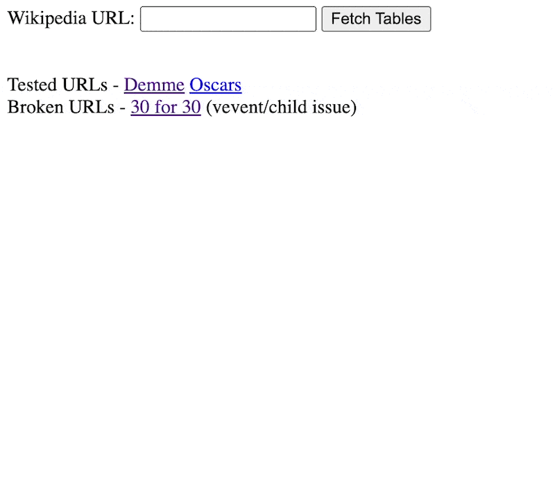

# Wikipedia Table Downloader
This is a flask app that enables downloading tabled data from wikipedia as a CSV file. It's designed to handle tables with complex structures, including those with rowspans and colspans. Created after realizing pasting this into a google sheet performs a similar action:

```
=importhtml("https://en.wikipedia.org/wiki/Jonathan_Demme","table",2)
```

## Installation
To run this application, you will need Python installed on your system along with the following dependencies:
- Flask
- BeautifulSoup4
- requests

You can install these dependencies using pip:

```pip install Flask BeautifulSoup4 requests```

## Usage
To use the application, follow these steps:

1. Start the Flask app:
Navigate to the folder containing the script and run:

```python app.py```

2. Access the application:
Open a web browser and go to http://127.0.0.1:5000/.

3. Enter a Wikipedia URL:
In the form presented, enter the full URL of a Wikipedia page whose tables you want to download.

4. Select a table to download:
After submitting the URL, the application will display all the tables found on the Wikipedia page. Click the "Download" button next to the table you wish to download as a CSV file.

The downloaded CSV file will be named according to the Wikipedia page title and the table index.



## Notes
The application currently handles only tables with the "wikitable" class.
It is tested with specific Wikipedia URLs but should work with most Wikipedia pages containing tables.

## License
This project is open source and available under the MIT License.
