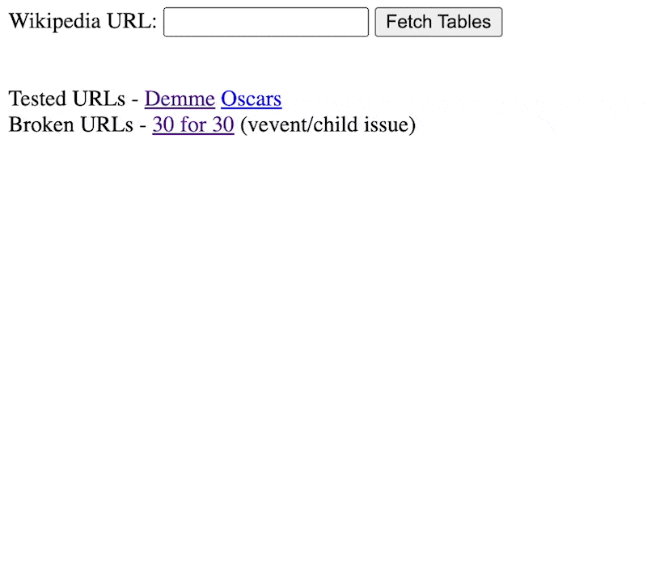

# Wikipedia Table Downloader
This is a flask app that enables downloading tabled data from wikipedia as a CSV file. It's designed to handle tables with complex structures, including those with rowspans and colspans. Created after realizing pasting this into a google sheet performs a similar action:

```
=importhtml("https://en.wikipedia.org/wiki/Jonathan_Demme","table",2)
```

## Installation
To run this application, you will need Python installed on your system along with the following dependencies:
- Flask
- BeautifulSoup4
- requests

You can install these dependencies using pip:

```pip install Flask BeautifulSoup4 requests```

Tested against Flask 3.1 and BeautifulSoup 4.14.

## Usage
To use the application, follow these steps:

1. Start the Flask app:
Navigate to the folder containing the script and run:

```python app.py```

2. Access the application:
Open a web browser and go to http://127.0.0.1:5000/.

3. Enter a Wikipedia URL:
In the form presented, enter the full URL of a Wikipedia page whose tables you want to download.

4. Select a table to download:
After submitting the URL, the application will display all the tables found on the Wikipedia page, each with its section heading and row count. Click the "Download CSV" button next to the table you want.

The downloaded CSV file is named after the Wikipedia page title and the table's position on the page, numbered from 1 to match the list — e.g. the first table on the Jonathan Demme page saves as `Jonathan_Demme_table_1.csv`.



## Notes
The application currently handles only tables with the "wikitable" class.
It is tested with specific Wikipedia URLs but should work with most Wikipedia pages containing tables.

Citation markers (`<sup class="reference">`) are stripped from cell text, so a rating renders as
`0.645` rather than `0.645[1]`.

Collapsible tables (the `tr.vevent` + `tr.expand-child` pattern used on pages like
[List of 30 for 30 films](https://en.wikipedia.org/wiki/List_of_30_for_30_films)) are handled by
appending each hidden description to its parent row as a trailing "Description" column.

Wikipedia rejects the default `python-requests` User-Agent with **HTTP 403**, so the app sends a
descriptive one per the
[Wikimedia User-Agent policy](https://foundation.wikimedia.org/wiki/Policy:Wikimedia_Foundation_User-Agent_Policy).
If you fork this, change `USER_AGENT` in `app.py` to identify your own project.

## License
This project is open source and available under the MIT License.
